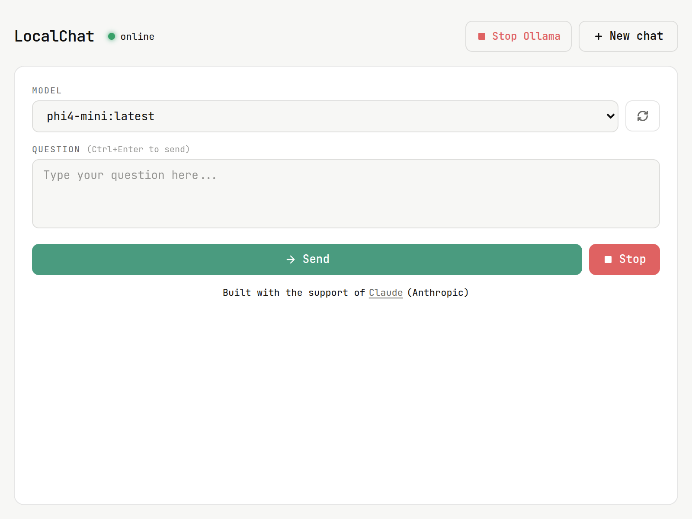
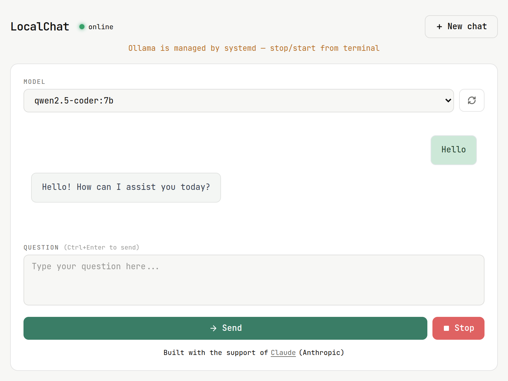
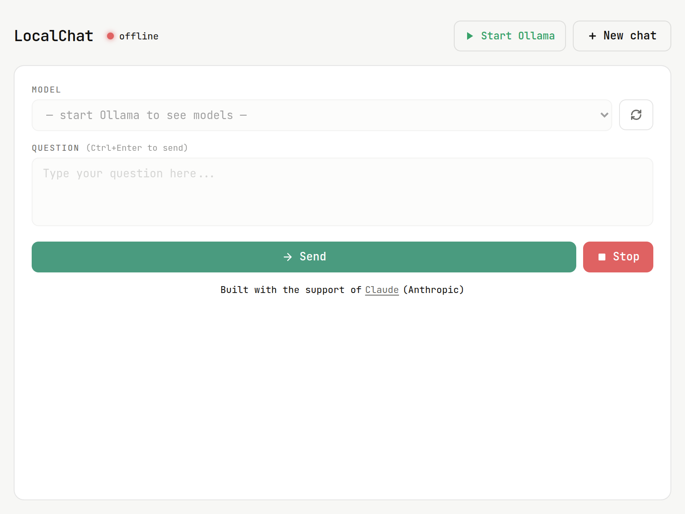
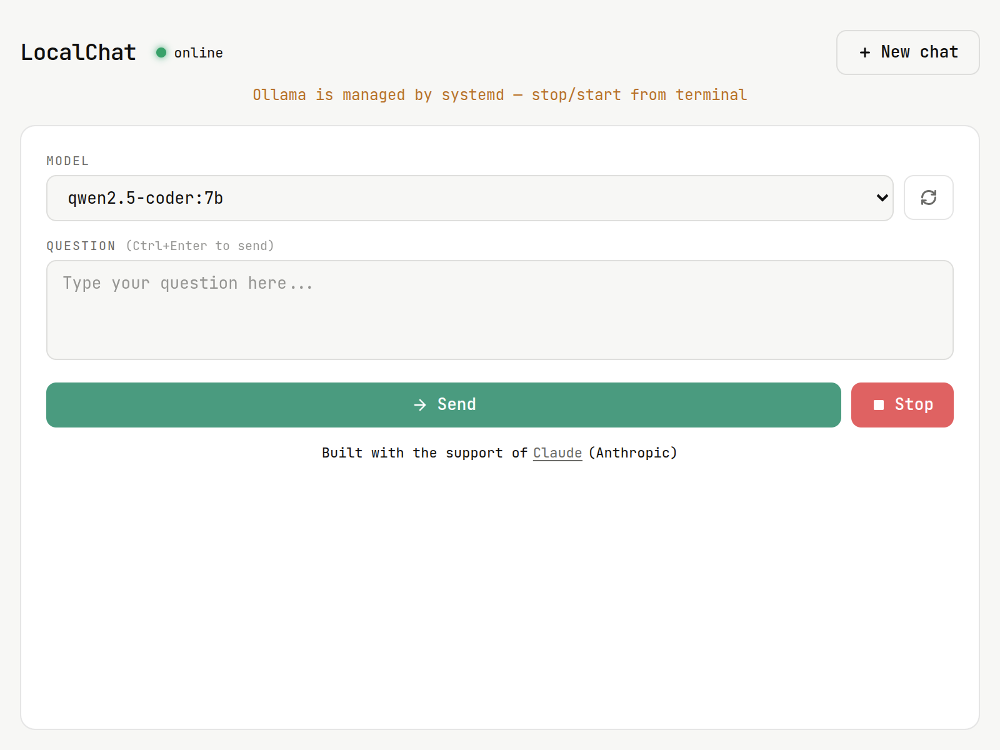

# Local Chat

LocalChat is a lightweight desktop app for chatting with local AI models through Ollama.
Everything runs on your machine, no API costs, no data sent to external servers.
Just pick a model, ask your question, and get a streaming response in real time.

---

## Screenshot

### App

App overview



### Response

LLM response example



### Ollama self managed

Start / Stop buttons are shown to manage Ollama



### Ollama managed by Systemd

Ollama startup is managed by the system



---

## Features

- Start and stop Ollama directly from the app interface
- Auto-detect locally installed models via the Ollama API
- Streaming responses with a real-time typewriter effect
- Simple interface: model selector, prompt input, output box
- Visual feedback during generation with loading indicator
- Checks Ollama status on startup and disables controls when offline

---

## Requirements

- [Ollama](https://ollama.com) installed and running

### Install Ollama

```bash
curl -fsSL https://ollama.com/install.sh | sh
```

### Recommended models

- `llama3.2:3b` ( ~2 GB ) General purpose, everyday questions
- `phi4-mini` ( ~2.5 GB ) Fast responses, low resource usage
- `qwen2.5-coder:7b` ( ~4.7 GB ) Code generation and technical tasks

### Install models

```bash
ollama pull llama3.2:3b
ollama pull phi4-mini
ollama pull qwen2.5-coder:7b
```

### Disable systemctl

Disable the systemd service to allow the app to manage Ollama directly

```bash
sudo systemctl stop ollama
sudo systemctl disable ollama
```

---

## Install

```bash
curl -fsSL https://github.com/gsandrini/local-chat/releases/latest/download/install.sh | bash
```

---

### Uninstall

```bash
curl -fsSL https://github.com/gsandrini/local-chat/releases/latest/download/install.sh | bash -s -- --uninstall
```

---

## Tech stack

- [Wails](https://wails.io) - Desktop framework (Go + WebView)
- [Go](https://golang.org) - Backend logic
- [Alpine.js](https://alpinejs.dev) - Reactive UI (bundled locally)
- [Tailwind CSS](https://tailwindcss.com) - Styling (compiled locally)
- [JetBrains Mono](https://www.jetbrains.com/lp/mono/) - Typography

---

## Built with

This project was built with the support of [Claude](https://claude.ai) by Anthropic.

---

## Contributing

This repository is published for personal use / GitHub Pages only.
Pull requests and issues will not be reviewed or accepted.

---

## License

This project is licensed under the **GNU General Public License v3.0**.
See the [LICENSE](LICENSE) file for details.
